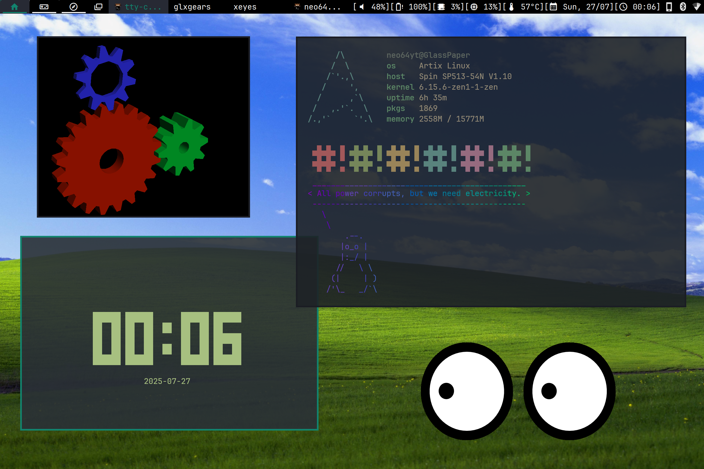

# dwm-pyromorphite

## ~**NOTICE:** Thanks to HiDPI, I might not be using standalone windows managers anymore, especially X11 ones. Therefore, I will not maintain this repository like I used to. However, I may still use this in VMs or on old computers.~
## **UPDATE:** I figured it out. WE ARE SO BACK.


dwm-pyromorphite (formerly dwm-neo64) is a heavily customized build of dwm (currently based on dwm-6.5) and a part of Pyromorphite Desktop. Since I have used this build without any new customization for at least two years and I'm quite comfortable with it, do not ever expect it to have frequent updates and new patches applied. I may keep it up to date to the latest upstream version when I feel the need to though.  

My dwm build is adapted to be used with the screen DPI set to 192. To you use it at 96 DPI, you may want to set everything related to the appearance of the bar and border (except for the font size) to half of their original set values.    

## Screenshot



## Patches used in this build

* actualfullscreen
* alternativetags
* alwayscenter
* aspectresize
* attachaside
* awesomebar 
* bar height
* centeredmaster
* clientindicatorshidevacanttags
* decorhints
* ewmhtags
* fixborders
* gaplessgrid
* nodmenu
* restartsig
* systray
* swallow
* underlinetags (modified)
* winicon

## Dependencies

* Xlib
* libxcb
* xcb-res
* Imlib2
* libxft
* libxinerama
* JetBrains Mono font
* Material Design Icons font

## Installation guide

### 1. Cloning this repository

Run this command:

```bash
git clone https://codeberg.org/neo64yt/dwm-pyromorphite
```

### 2. Installing dwm

You can either run the installation script (`install.sh`) or run this in the terminal:

```bash
sudo make install 
```

### 3. Running dwm and autostarting applications

#### Autostarting

Autostart applications must be put in `$XDG_CONFIG_HOME/dwm/autostart.sh`. It will automatically be executed by `/usr/local/bin/dwm-session`.

This is a sample of `autostart.sh`:

```bash
#!/bin/sh
# This example script starts mate-polkit and sxhkd with a custom config file
/usr/lib/mate-polkit/polkit-mate-authentication-agent-1 &
sxhkd -c $XDG_CONFIG_HOME/dwm/sxhkdrc &
```

#### Environment variables

To load environment variables, put them under the `Env envs` array in `config.def.h`. For example, I have set the `XDG_CURRENT_DESKTOP` variable like below:

```c
static const Env envs[] = {
	/* variable			        value */
	{ "XDG_CURRENT_DESKTOP",	"dwm" },
};
```

#### Running dwm (with a display manager)

"Dynamic Window Manager (dwm)" should be an option available after installation.

#### Running dwm (using `startx`)

Put `exec /usr/local/bin/dwm-session` at the bottom of your `.xinitrc` file.

## Making new customizations

You may want to make customizations on this dwm build to have it as your own. Just like the upstream build of dwm (or any other suckless software), customizations are made by editing the source code (mainly `config.def.h`) and applying patches. For a patching guide, refer to https://dwm.suckless.org/customisation/patches_in_git/ (the recommended method) or if you prefer not to use git, the method to do it (used by many dwm users, including me with this build) is:

```bash
patch -p1 < /path/to/patch.diff
```

When all the customizations you want to make are done, run the `cleandir.sh` script before reinstalling dwm again just like in the installation guide above.

## Keybindings

Will be updated soon in the man page!
