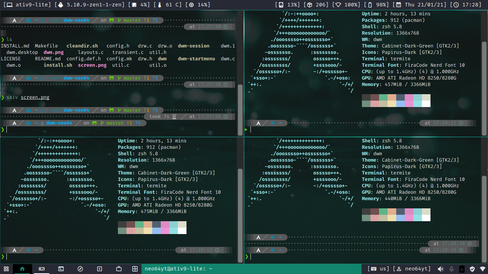

# dwm-neo64
dwm (Dynamic Window Manager) is a lightweight dynamic window manager by suckless.org. It is written in C to get great performance with little usage of resources. It is customized by editing the source code which keeps it simple, fast and lightweight. This is my heavily patched dwm build which is suitable for new users (I guess). Still a work in progress.

## Example screenshot with default color scheme


### Patches that I use for this build:
* activetagindicatorbar (modified)
* alternativetags
* aspectresize
* attachaside
* bar height
* colorbar
* extrabar
* gridmode
* nodmenu
* resizecorners
* systray
* statusbutton
* swallow
### Important parts of my dwm build 
Make sure you don't accidentally delete these files to make it run properly:

* /usr/local/bin/dwm (binary file)
* /usr/local/bin/dwm-session (shell script for detecting autostart file)
* /usr/local/bin/dwm-startmenu (shell script for dwm start menu button)
* /usr/share/xsessions/dwm.desktop (desktop entry)
* $HOME/.dwm/autostart.sh (autostart file)

## Installation guide

### 1. Cloning this repository
Run this command:
```
git clone https://github.com/neo64yt/dwm-neo64.git
```

### 2. Installing dwm
cd into the build directory and run:
```
./install.sh
```

### 3. Dependencies
You may want to install these applications to work with dwm:
* sxhkd (setting keybindings. I didn't set them directly into my dwm source code :P )
* nitrogen (setting wallpaper)
* [my dmenu build](https://github.com/neo64yt/dmenu-neo64/) (for launching applications)
* nm-applet (network management)
* volumeicon (change audio volume)
* dunst (notification server)
* mate-polkit/polkit-gnome (running apps which need administrative permissions)
* ttf-material-design-icons-extended (showing icons)
* ttf-fira-code (default font for my build)
* [my dotfiles](https://github.com/neo64yt/dotfiles/) (integrated seamlessly with this build of dwm)
* slstatus (my own, optimized for my build, coming soon)

### 4. Running dwm at startup & autostart applications
Autostart applications must be put into "$HOME/.config/dwm/autostart.sh". It will be automatically detected by "/usr/local/bin/dwm-session".

This is a sample of autostart.sh:
```
#!/bin/sh
/usr/lib/mate-polkit/polkit-mate-authentication-agent-1 &
sxhkd -c $HOME/.dwm/sxhkdrc &
# This example script starts mate-polkit and sxhkd with a custom config file
```

#### With display manager
A desktop entry file for dwm will be automatically installed to "/usr/share/xsessions/".

#### Without display manager
Put "exec /usr/local/bin/dwm-session" into your .xinitrc file.

## Customizing dwm
dwm is customizable by editing the source code (mainly config.def.h) and patching. To apply a patch, go to this build directory and execute:
```
patch < /directory/to/patch/file.diff
# Change the placeholder with a valid file location
```
If the patch has failed hunks, manually patch by reading the REJ files in this build directory to guide you.
Make sure you executed cleandir.sh file before recompiling dwm (executing install.sh)

## Keybindings
Will be updated soon in the man page!

## Start menu 
Please put your choice of start menu in the .xprofile file by setting the environment variable for $STARTPROMPT
Example:
```
export STARTPROMPT=rofi
```

